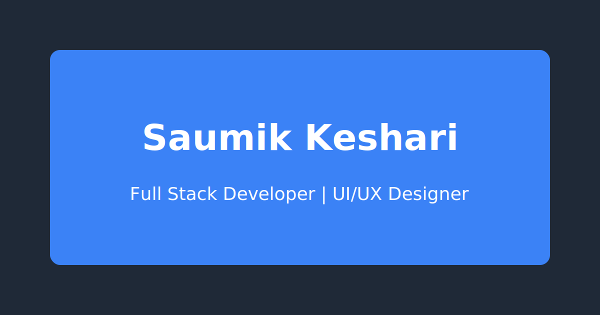

# Saumik Keshari - Portfolio

A modern, responsive portfolio website showcasing my work as a Full Stack Developer, UI/UX Designer, and Software Developer. Built with React, TypeScript, and Tailwind CSS.



## 🌟 Features

- **Modern Design**: Clean and professional UI with smooth animations
- **Responsive**: Fully responsive design that works on all devices
- **Dynamic Content**: Animated typing effect for role display
- **Dark Mode**: Built-in dark mode support
- **Performance Optimized**: Fast loading and smooth transitions
- **SEO Friendly**: Proper meta tags and semantic HTML
- **Accessibility**: WCAG 2.1 compliant
- **Cross-browser**: Works on all modern browsers

## 🛠️ Technologies Used

- **Frontend Framework**: React.js
- **Language**: TypeScript
- **Styling**: Tailwind CSS
- **Animations**: Framer Motion
- **Icons**: React Icons, Heroicons
- **UI Components**: Headless UI
- **Build Tool**: Create React App
- **Package Manager**: npm

## 📦 Installation

1. Clone the repository:
```bash
git clone https://github.com/yourusername/portfolio.git
```

2. Navigate to the project directory:
```bash
cd portfolio
```

3. Install dependencies:
```bash
npm install
```

4. Start the development server:
```bash
npm start
```

The application will be available at `http://localhost:3000`.

## 🏗️ Project Structure

```
portfolio/
├── public/
│   ├── favicon.svg
│   ├── logo.svg
│   ├── og-image.svg
│   ├── hero-bg.jpg
│   ├── index.html
│   ├── manifest.json
│   ├── robots.txt
│   └── sitemap.xml
├── src/
│   ├── components/
│   │   ├── Hero.tsx
│   │   ├── Navbar.tsx
│   │   ├── Skills.tsx
│   │   ├── Projects.tsx
│   │   ├── Experience.tsx
│   │   ├── Contact.tsx
│   │   └── Footer.tsx
│   ├── App.tsx
│   ├── index.tsx
│   └── index.css
├── package.json
├── tsconfig.json
├── tailwind.config.js
├── postcss.config.js
└── .prettierrc
```

## 🎨 Customization

### Changing Colors
Edit the `tailwind.config.js` file to modify the color scheme:

```javascript
theme: {
  extend: {
    colors: {
      primary: {
        DEFAULT: '#3B82F6',
        dark: '#1E40AF',
        light: '#60A5FA',
      },
      secondary: {
        DEFAULT: '#10B981',
        dark: '#065F46',
        light: '#34D399',
      },
      // Add your custom colors here
    },
  },
}
```

### Updating Content
- Edit the `Hero.tsx` component to update your name and roles
- Modify the `Projects.tsx` component to showcase your work
- Update the `Skills.tsx` component with your expertise
- Edit the `Experience.tsx` component with your work history

### Adding New Sections
1. Create a new component in the `src/components` directory
2. Import and add the component to `App.tsx`
3. Style the component using Tailwind CSS classes

## 📱 Responsive Design

The portfolio is fully responsive and optimized for:
- Mobile devices (320px and up)
- Tablets (768px and up)
- Laptops (1024px and up)
- Desktop screens (1280px and up)

## 🚀 Deployment

1. Build the project:
```bash
npm run build
```

2. Deploy the `build` folder to your preferred hosting service:
- [Vercel](https://vercel.com)
- [Netlify](https://netlify.com)
- [GitHub Pages](https://pages.github.com)
- [AWS](https://aws.amazon.com)
- [Firebase Hosting](https://firebase.google.com)

## 🧪 Testing

Run the test suite:
```bash
npm test
```

## 📝 Code Quality

- Lint your code:
```bash
npm run lint
```

- Format your code:
```bash
npm run format
```

## 📄 License

This project is licensed under the MIT License - see the [LICENSE](LICENSE) file for details.

## 👥 Contributing

Contributions are welcome! Please feel free to submit a Pull Request.

1. Fork the repository
2. Create your feature branch (`git checkout -b feature/AmazingFeature`)
3. Commit your changes (`git commit -m 'Add some AmazingFeature'`)
4. Push to the branch (`git push origin feature/AmazingFeature`)
5. Open a Pull Request

## 📞 Contact

- GitHub: [@yourusername](https://github.com/yourusername)
- LinkedIn: [Your Name](https://linkedin.com/in/yourusername)
- Twitter: [@yourusername](https://twitter.com/yourusername)
- Email: your.email@example.com

## 🙏 Acknowledgments

- [React](https://reactjs.org/)
- [Tailwind CSS](https://tailwindcss.com/)
- [Framer Motion](https://www.framer.com/motion/)
- [React Icons](https://react-icons.github.io/react-icons/)
- [Headless UI](https://headlessui.dev/)
- [Create React App](https://create-react-app.dev/)
- [TypeScript](https://www.typescriptlang.org/) 